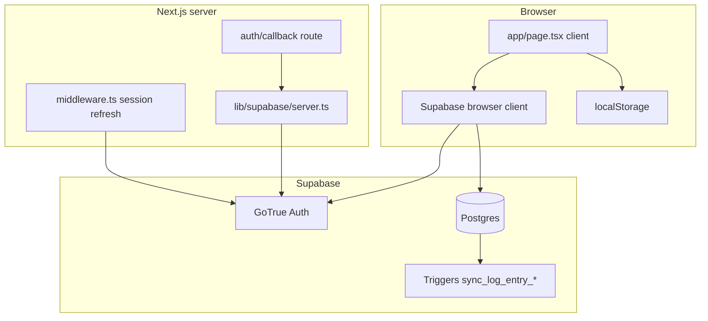

# GastroGuard — Formal System Specification (Reverse-Engineered)

This document is derived from the codebase and canonical SQL in [`supabase/gastroguard_production_schema_v2.sql`](../supabase/gastroguard_production_schema_v2.sql). It describes **as-built** behavior, not a marketing summary.

---

## 1. System identity and scope

**Name:** GastroGuard (`gastro-guard`, package version `0.1.0` per [`package.json`](../package.json)).

**Purpose:** A web application for tracking digestive-health-related symptoms (pain, stress, symptoms, triggers, remedies, meal context), optionally persisting data to Supabase for cross-device sync. The UI presents itself as a gastritis / chronic stomach condition tracker ([`app/layout.tsx`](../app/layout.tsx) metadata, [`public/manifest.json`](../public/manifest.json)).

**In scope (this repo):**

- Next.js 14 App Router client UI (primary surface: [`app/page.tsx`](../app/page.tsx)).
- Supabase Auth (email/password) and Postgres-backed storage.
- SQL-defined schema, triggers, RLS, views, and server-side analytics/recommendation refresh functions.

**Out of scope / parallel artifacts:** Root-level Python desktop app files (e.g. `gastroguard_enhancedv3.py`) and zip-oriented docs ([`DEVELOPER_DELIVERY_GUIDE.md`](../DEVELOPER_DELIVERY_GUIDE.md)) describe a **different distribution**; the live web stack is Next + Supabase.

---

## 2. Stakeholder intent (inferred)

| Intent | Evidence |
|--------|----------|
| **Privacy by default** | All user tables use RLS with `auth.uid() = user_id`; timeline view uses `security_invoker` and denies anonymous reads ([schema Section 8, 12, 13](../supabase/gastroguard_production_schema_v2.sql)). |
| **Single write surface for logs** | Clients write `log_entries`; normalized event tables are populated by triggers, not direct client writes ([`sync_log_entry_to_normalized`](../supabase/gastroguard_production_schema_v2.sql)). |
| **Richer analytics later** | `refresh_user_analytics`, `refresh_user_recommendations`, `weekly_summaries`, `analytics_*` tables ([schema Section 10](../supabase/gastroguard_production_schema_v2.sql)). |
| **Offline / anonymous use** | When unauthenticated, [`app/page.tsx`](../app/page.tsx) persists entries and profile to `localStorage` keys `gastroguard-entries`, `gastroguard-profile`, `gastroguard-integrations`. |
| **PWA / installable** | [`public/manifest.json`](../public/manifest.json), service worker registration in [`app/layout.tsx`](../app/layout.tsx) (worker file: [`public/sw.js`](../public/sw.js)). |

---

## 3. Logical architecture

**Responsibility split:**

- **Browser:** UI state, form validation (implicit), local persistence when logged out, all authenticated reads/writes via `@supabase/supabase-js` + [`@/lib/supabase/client`](../lib/supabase/client.ts).
- **Next middleware:** Session cookie refresh on matched routes ([`middleware.ts`](../middleware.ts), [`lib/supabase/middleware.ts`](../lib/supabase/middleware.ts)); no route protection logic beyond `getUser()`.
- **Next route handler:** OAuth/PKCE code exchange at [`app/auth/callback/route.ts`](../app/auth/callback/route.ts).
- **Postgres:** Authoritative storage, normalization pipeline, optional batch analytics via RPCs.

---

## 4. Application structure (as implemented)

| Path | Role |
|------|------|
| [`app/page.tsx`](../app/page.tsx) | **Monolithic client application:** auth listener, profile CRUD, log CRUD, integrations UI, analytics timeline view, dashboard/navigation, recommendations helper (client-side heuristics). |
| [`app/auth/page.tsx`](../app/auth/page.tsx) | Email/password sign-up and sign-in; redirects to `/` on success. |
| [`app/auth/callback/route.ts`](../app/auth/callback/route.ts) | Exchanges `code` for session; redirects to `next` or `/` or error. |
| [`lib/supabase/client.ts`](../lib/supabase/client.ts) | `createBrowserClient` with `NEXT_PUBLIC_SUPABASE_URL`, `NEXT_PUBLIC_SUPABASE_ANON_KEY`. |
| [`lib/supabase/server.ts`](../lib/supabase/server.ts) | Cookie-bound server client for Route Handlers / Server Components. |
| [`lib/profile.ts`](../lib/profile.ts) | Maps `profiles` row ↔ `UserProfile` / `Integration[]`; upsert payload builder. |
| [`lib/adapter/log-entry.ts`](../lib/adapter/log-entry.ts) | Maps form state ↔ `log_entries` columns; merges contextual fields into `meal_notes`. |
| [`lib/types/log-entry.ts`](../lib/types/log-entry.ts) | Typed JSONB element shapes (symptoms/triggers/remedies/food tags). |
| [`components/theme-provider.tsx`](../components/theme-provider.tsx) | Present; not central to data flow. |

**Notable omission:** There is **no** separate API route layer for domain logic; business rules for “recommendations” in the UI are implemented in [`app/page.tsx`](../app/page.tsx) as TypeScript conditionals, not via `refresh_user_recommendations` or `recommendation_cache`.

---

## 5. Authentication and session model

- **Methods:** `signUp`, `signInWithPassword` ([`app/auth/page.tsx`](../app/auth/page.tsx)); session stored in cookies via `@supabase/ssr`.
- **Middleware:** Every matched request runs `supabase.auth.getUser()` to refresh the session ([`lib/supabase/middleware.ts`](../lib/supabase/middleware.ts)).
- **Profile bootstrap:** `handle_new_user` trigger on `auth.users` inserts into `profiles` with name from `raw_user_meta_data` ([schema](../supabase/gastroguard_production_schema_v2.sql)).
- **Client:** `onAuthStateChange` and `getSession()` drive React `user` state ([`app/page.tsx`](../app/page.tsx)).

---

## 6. Data architecture

### 6.1 Canonical tables (conceptual ER)

- **`auth.users`** (Supabase) — identity.
- **`profiles`** — 1:1 with `user_id`; scalar demographics; JSONB arrays for allergies, dietary restrictions, profile-level triggers, effective remedies, integrations; **not** legacy `conditions`/`medications` columns in v2 (normalized tables instead) ([schema header + table](../supabase/gastroguard_production_schema_v2.sql)).
- **`profile_conditions`**, **`medications`** — normalized profile medical lists (RLS same pattern).
- **`log_entries`** — **primary append/update surface** for the app: scores, JSONB arrays for symptoms/triggers/remedies/food_tags, timestamps `entry_at`, `entry_date`, optional `episode_at`, `meal_occurred_at`.
- **`log_days`** — day anchor per user/date; sync upserts rows.
- **Normalized events:** `meal_events`, `symptom_events`, `remedy_events`, `trigger_events` — each links to `source_entry_id` → `log_entries.id`.
- **Tags:** `meal_tags`, `symptom_tags`, junction tables `meal_event_meal_tags`, `symptom_event_symptom_tags`.
- **Analytics cache:** `analytics_trigger_scores`, `analytics_remedy_scores`, `analytics_food_scores`, `analytics_time_patterns`, `weekly_summaries`, `recommendation_cache`.

### 6.2 Row Level Security

Uniform policy generator: for each listed table, **SELECT/INSERT/UPDATE/DELETE** require `auth.uid() is not null AND auth.uid() = user_id` ([schema Section 8](../supabase/gastroguard_production_schema_v2.sql)). `profiles` participates with `user_id` as the subject column.

### 6.3 View: `v_user_timeline`

**Definition:** `UNION ALL` of normalized streams: log entries, meals, symptoms, remedies, triggers — each with `event_type`, `occurred_at`, `title`, `details` JSONB, `source_entry_id` ([schema Section 12](../supabase/gastroguard_production_schema_v2.sql)).

**Security:** `security_invoker = true` so the **caller's** RLS applies; `SELECT` granted to `authenticated` only (not `anon`) in v2.

---

## 7. Core processing logic: log sync pipeline

**Trigger chain:** `AFTER INSERT/UPDATE/DELETE` on `log_entries` → `sync_log_entry_on_*` → `sync_log_entry_to_normalized` (or delete path) ([schema Section 9, 11](../supabase/gastroguard_production_schema_v2.sql)).

**`sync_log_entry_to_normalized` behavior (summary):**

1. Computes effective times: `episode_at` or `entry_at`; meal time from `meal_occurred_at` or effective time.
2. Upserts `log_days` for `entry_date`.
3. If meal signals present (`meal_name`, `meal_notes`, or non-empty `food_tags`), inserts `meal_events` and expands `food_tags` JSONB into `meal_tags` + `meal_event_meal_tags` (supports string or `{tag:...}` elements).
4. Iterates `symptoms`, `remedies`, `triggers` JSONB arrays; uses `safe_int()` for numeric fields; inserts into respective `*_events` tables.

**Update strategy:** Comments in SQL state **delete-and-rebuild** for updates (full resync for that entry).

**Intent:** Keep a **denormalized capture row** (`log_entries`) for fast client I/O while maintaining a **queryable event model** for analytics and timeline.

---

## 8. Analytics and recommendations (database vs app)

**Database capabilities:**

- **`refresh_user_analytics(p_user_id, p_from, p_to)`** — `security invoker`; refuses when `auth.uid()` is set and differs from `p_user_id` (allows service role with null uid per comment). Populates `weekly_summaries`, `analytics_*` tables from `log_entries` and normalized events ([schema Section 10](../supabase/gastroguard_production_schema_v2.sql)).
- **`refresh_user_recommendations`** — builds/refreshes `recommendation_cache` (defined later in same section).

**Current client usage:** [`app/page.tsx`](../app/page.tsx) loads the timeline via `.from("v_user_timeline").select(...)` for authenticated users. **No** `supabase.rpc('refresh_user_analytics', ...)` or `refresh_user_recommendations` appears in application TypeScript/TSX sources. Personalized text shown in the app uses **`getPersonalizedRecommendations()`** in-page (profile name + pain thresholds), i.e. **client-side heuristics**, not DB-backed recommendation rows.

**Formal boundary:** The **database is prepared** for batch/scheduled analytics; the **shipping UI** primarily consumes `log_entries`, `profiles`, and `v_user_timeline`.

---

## 9. Client ↔ database mapping

| Domain | Client | Database |
|--------|--------|----------|
| Log save | `toDbPayload` / `toDbUpdatePayload` | `log_entries` insert/update |
| Log list | `fromDbRow` | `select *` ordered by `entry_at` |
| Profile | `userProfileToUpsert`, `fetchProfileAndIntegrations` | `profiles` |
| Integrations | Stored as JSON in `profiles.integrations` | Same |
| Timeline | `AnalyticsView` | `v_user_timeline` |

**Adapter detail:** Optional fields (sleep, exercise, weather, ingestion) are **not** separate columns in the adapter’s default insert; they are concatenated into `meal_notes` for storage ([`buildPayloadFields`](../lib/adapter/log-entry.ts)).

---

## 10. Integrations (conceptual vs enforcement)

The UI lets users create named integrations with generated `gg_…` API keys and permission labels ([`app/page.tsx`](../app/page.tsx)). These records are stored in `profiles.integrations` JSONB. **There is no** Edge Function or RLS policy in the reviewed TS/SQL path that validates those keys for external API access—integration is **data-shaped placeholders** for future or manual use unless another service consumes them.

---

## 11. Deployment and configuration

- **Required env:** `NEXT_PUBLIC_SUPABASE_URL`, `NEXT_PUBLIC_SUPABASE_ANON_KEY` ([`lib/supabase/client.ts`](../lib/supabase/client.ts)).
- **Hosting:** Vercel-oriented docs exist ([`VERCEL_DEPLOY.md`](../VERCEL_DEPLOY.md)). `@vercel/analytics` is listed in [`package.json`](../package.json) but is **not** imported or used in application `*.ts` / `*.tsx` sources as of this specification.
- **PWA:** [`public/sw.js`](../public/sw.js) is registered from [`app/layout.tsx`](../app/layout.tsx).

---

## 12. Incremental SQL delivery (repository)

Migrations under [`supabase/migrations/`](../supabase/migrations/) and bundle [`supabase/supabase_sql_editor_p0_through_p3.sql`](../supabase/supabase_sql_editor_p0_through_p3.sql) apply P0–P3 patches (security hardening on timeline and RPCs, JSONB integrity, legacy profile view, refinements) **on top of** v2 where applicable—aligned with operational runbooks from prior work.

---

## 13. System invariants (formal)

1. Every persisted health row is scoped by **`user_id`** and enforced by **RLS** for the `authenticated` role.
2. **`log_entries`** is the sole client write path for symptom logs; normalized tables are **derivative**.
3. **Timeline reads** must go through **`v_user_timeline`** with an authenticated JWT so `security_invoker` applies.
4. **`entry_date`** anchors day-level grouping; **`entry_at`** anchors UTC time series and analytics windows (schema comments).

---

## 14. Known asymmetries (for auditors)

- **Recommendations:** DB functions and cache tables exist; **primary UI** uses offline heuristics.
- **Normalized profile conditions/medications:** Schema favors tables; **client** `UserProfile` still has `conditions` / `medications` arrays—merge behavior depends on API usage (see profile load/merge in [`app/page.tsx`](../app/page.tsx)).
- **Middleware** does not enforce login redirects; unauthenticated users can use the app with localStorage.

---

This specification is sufficient to reason about security boundaries, data flow, and where future work (wire RPCs, Edge API for integrations) would attach without changing the core invariant model.
